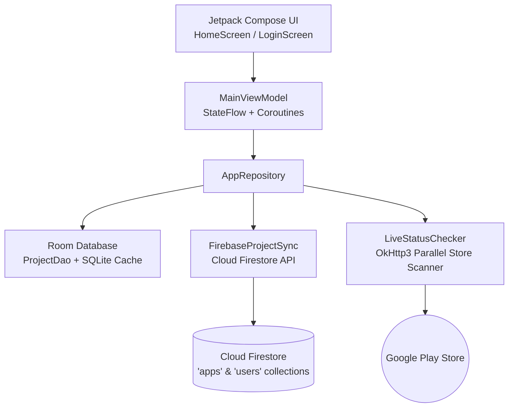

<div align="center">

# 📱 AppTrack

**A sleek, production-grade Android client portal for monitoring live store availability, publishing statuses, and application metrics.**

[-3DDC84?style=for-the-badge&logo=android&logoColor=white)](https://developer.android.com)
[](https://kotlinlang.org)
[](https://developer.android.com/jetpack/compose)
[](https://firebase.google.com)
[](https://developer.android.com/topic/architecture)

<br/>

> **Track all your apps and games in one synchronized place.** Built natively with Kotlin and Jetpack Compose, AppTrack empowers developers and clients to monitor store status, launch metrics, and project health in real-time.

</div>

---

## ✨ Key Highlights

- 📊 **Real-time Live Store Checking**: On-demand and automatic parallel verification against Google Play Store endpoints without rate-limit bottlenecks.
- 🎮 **Isolated Category Tabs**: Independent segmented control separating **Applications** and **Games** with custom styling, dedicated empty states, and badge counters.
- ☁️ **Cloud Firestore Synchronization**: Cloud-synchronized client catalog with strict Server-first fetching and local SQLite Room fallback caching.
- 🎨 **Dynamic Theme-Matched UI**: Royal blue glassmorphic surfaces, responsive empty states, fluid pull-to-refresh animations, and clean adaptive brand glyphs.
- 🔐 **Zero-Hardcoding Architecture**: Strictly respects backend fields, dynamic image resolvers, and multi-strategy client profile lookups.
- 📦 **Continuous Delivery Pipeline**: Automated GitHub Actions workflow generating signed release APKs and GitHub releases.

---

## 🏗️ Architecture & Tech Stack



| Layer | Technologies |
| :--- | :--- |
| **Language & Concurrency** | Kotlin 2.0, Coroutines, StateFlow, Channel |
| **Presentation (UI)** | Jetpack Compose, Material 3, Navigation, AnimatedVisibility |
| **Architecture** | Clean Architecture, MVVM, Single Source of Truth pattern |
| **Local Persistence** | Android Room Database, KSP, SQLite |
| **Backend & Sync** | Firebase Cloud Firestore, Firebase Authentication |
| **Networking** | OkHttp3, Retrofit2, Coil (Async Image Loading) |
| **Build & CI/CD** | Gradle Kotlin DSL (`build.gradle.kts`), GitHub Actions |

---

## 🗄️ Firestore Database Schema

AppTrack syncs seamlessly with Google Cloud Firestore using two primary collections:

### 1. `apps` Collection
Stores applications and games tracked by the system.

| Field Name | Type | Description |
| :--- | :--- | :--- |
| `title` | `string` | Display name of the application (e.g., `"CaloZen"`). |
| `packageName` | `string` | Unique Android package identifier (e.g., `"com.zenith.calozen.nutrition"`). |
| `category` | `string` | Category type: `"APP"` or `"GAME"`. |
| `userEmail` | `string` | Email of the assigned user/client for strict isolation. |
| `status` *(optional)* | `string` | `"LIVE"` or `"PENDING"`. Automatically verified against Play Store. |
| `iconUrl` *(optional)* | `string` | Public image URL for the app icon. Falls back to theme glyph if blank. |

### 2. `users` Collection
Stores profile metadata for authenticated clients.

| Field Name | Type | Description |
| :--- | :--- | :--- |
| `email` | `string` | User login email (e.g., `"client@example.com"`). |
| `name` | `string` | Full display name shown on greeting header (e.g., `"Malik Yaqoob"`). |
| `role` | `string` | User authorization role (e.g., `"CLIENT"`). |

---

## 🚀 Getting Started

### Prerequisites

- **Android Studio**: Ladybug (2024.2.1) or newer
- **JDK**: Version 17+
- **Android SDK**: API 35/36 installed

### Installation & Run

1. **Clone the repository:**
   ```bash
   git clone https://github.com/mzaid-dev/AppTrack.git
   cd AppTrack
   ```

2. **Configure environment:**
   ```bash
   cp .env.example .env
   ```

3. **Add Firebase configuration:**
   Place your project's `google-services.json` inside the `app/` folder.

4. **Assemble & Install:**
   ```bash
   # Build debug APK
   ./gradlew assembleDebug

   # Or build signed release APK
   ./gradlew assembleRelease
   ```

---

## 📦 CI/CD & Automated Releases

Automated builds, lint checks, and signed APK release artifacts are generated on push to `main` via the GitHub Actions pipeline:

- Workflow definition: [`.github/workflows/release.yml`](.github/workflows/release.yml)
- Artifacts: Downloadable `app-release.apk` with automated release notes and tags.

---

<div align="center">

Made with ❤️ using **Jetpack Compose** & **Kotlin**

</div>
------------------------------