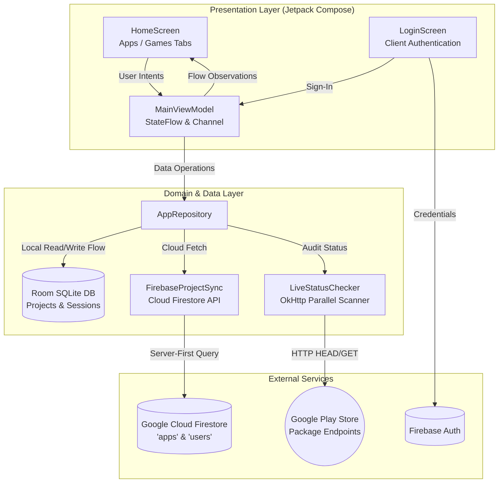
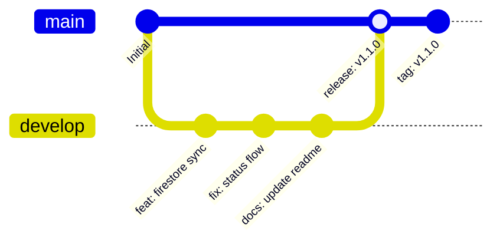

<div align="center">

# 📱 AppTrack

**A sleek, production-ready Android client portal for real-time Google Play Store availability tracking, live status monitoring, and cloud-synchronized catalog management.**

[-3DDC84?style=for-the-badge&logo=android&logoColor=white)](https://developer.android.com)
[](https://kotlinlang.org)
[](https://developer.android.com/jetpack/compose)
[](https://firebase.google.com)
[](https://developer.android.com/topic/architecture)
[](LICENSE)

<br/>

> **Track all your applications and games in one unified dashboard.** Engineered with Jetpack Compose, Room SQLite, and Firebase Cloud Firestore, AppTrack empowers product teams and clients to monitor store availability, launch progress, and status changes in real time.

</div>

---

## 📑 Table of Contents

- [✨ Core Features](#-core-features)
- [🏷️ Status Verification & Badge System](#️-status-verification--badge-system)
- [🏗️ Architecture & Data Flow](#️-architecture--data-flow)
- [📁 Project Structure](#-project-structure)
- [🗄️ Firestore Database Schema](#️-firestore-database-schema)
- [🔍 Real-Time Play Store Verification Engine](#-real-time-play-store-verification-engine)
- [🛠️ Tech Stack & Dependencies](#️-tech-stack--dependencies)
- [🚀 Setup & Build Instructions](#-setup--build-instructions)
- [🌿 Branching & Release Strategy](#-branching--release-strategy)

---

## ✨ Core Features

- 🟢 **Automated Play Store Audit on Launch**: Immediately on startup, AppTrack audits all catalog items in parallel across categories, verifying whether packages are live, pending, or unindexed.
- ⚡ **Granular Badge-Only Reactive Updates**: Refreshing or auditing items updates status badges seamlessly in-place from the local Room database, eliminating UI flicker and preserving scroll position.
- 🎮 **Segmented Category Management**: Dedicated tabs for **Apps** and **Games** with independent counters, isolated pull-to-refresh scopes, and distinct empty states.
- ☁️ **Cloud-Synced Client Isolation**: Connects to Google Cloud Firestore using server-first retrieval, filtering items strictly to the authenticated client's email.
- 💾 **Offline-First Room Persistence**: Full local SQLite caching via Room ensures instant boot times, zero blank screens, and complete offline browsing capability.
- 🚀 **Direct Play Store Navigation**: Quick one-tap launcher opens the live application directly in the Google Play Store or native browser.
- 🎨 **Modern Material 3 Design**: Royal blue design tokens (`#0F52BA`), responsive typography, smooth animated visibility transitions, and theme-matched glyph fallbacks.

---

## 🏷️ Status Verification & Badge System

AppTrack provides unambiguous, high-contrast badges representing each app's exact Play Store availability:

| Badge Label | Visual Style | Database Value (`status`) | Description |
| :--- | :--- | :--- | :--- |
| **Live on Play Store** | 🟢 Emerald Green | `LIVE` | The package is publicly accessible and verified on Google Play Store. |
| **Not on Store** | 🟠 Coral Red | `NOT_FOUND` | Google Play returned `404` or "Item not found". App is not yet published. |
| **Unable to Check** | 🔴 Crimson Red | `UNABLE_TO_CHECK` | Network timeout, DNS issue, or connection failure during inspection. |
| **Pending Check** | ⚪ Slate Gray | `PENDING` | Newly synced or unverified item waiting for initial verification. |
| **Checking…** | 🔵 Ocean Blue (Pulse) | *In-Memory Transient* | Background coroutine is actively scanning the Play Store endpoint. |

### How the Badge Lifecycle Operates:
1. **On App Startup**: All user apps across tabs are dispatched into `MainViewModel.checkAllTabsStatus()`.
2. **Parallel Coroutines**: Background workers query the Play Store in parallel via `supervisorScope`.
3. **Database Writeback**: Each completed check updates the item's `status` and `lastCheckedTimestamp` directly in Room SQLite.
4. **Reactive Emission**: Room's `Flow<List<ProjectEntity>>` emits the update, causing Jetpack Compose to redraw *only* the affected card badge without rebuilding the list.

---

## 🏗️ Architecture & Data Flow

AppTrack follows Google's recommended **Clean Architecture** and **MVVM** pattern with a Single Source of Truth (SSOT).



---

## 📁 Project Structure

```
AppTrack/
├── app/
│   ├── src/main/
│   │   ├── java/com/example/
│   │   │   ├── MainActivity.kt          # Main Activity & Navigation Host
│   │   │   ├── data/
│   │   │   │   ├── firebase/            # Firestore client synchronizer
│   │   │   │   │   └── FirebaseProjectSync.kt
│   │   │   │   ├── local/               # Room Database, DAOs, & SQLite Converters
│   │   │   │   │   ├── AppDatabase.kt
│   │   │   │   │   └── ProjectDao.kt
│   │   │   │   ├── model/               # Data classes, Entities, & Enums
│   │   │   │   │   └── Models.kt
│   │   │   │   ├── network/             # Network verification engine
│   │   │   │   │   └── LiveStatusChecker.kt
│   │   │   │   └── repository/          # Unified AppRepository (SSOT)
│   │   │   │       └── AppRepository.kt
│   │   │   └── ui/
│   │   │       ├── MainViewModel.kt     # Reactive State & Coroutine dispatchers
│   │   │       ├── screens/
│   │   │       │   ├── HomeScreen.kt    # Main dashboard with segmented tabs & cards
│   │   │       │   └── LoginScreen.kt   # Clean, branded authentication view
│   │   │       └── theme/               # Color tokens, Typography, & M3 Shapes
│   │   └── res/                         # Vector assets, mipmaps, strings
│   └── build.gradle.kts                 # App-level build script & dependencies
├── .github/workflows/
│   └── release.yml                      # CI/CD Automated Build & Release workflow
└── README.md
```

---

## 🗄️ Firestore Database Schema

AppTrack connects to Google Cloud Firestore with strict document schemas:

### 1. `apps` Collection
Stores applications and games monitored by the portal.

| Field Name | Type | Required | Description |
| :--- | :--- | :---: | :--- |
| `title` | `string` | Yes | Display title of the application (e.g., `"CaloZen Fitness"`). |
| `packageName` | `string` | Yes | Unique Android applicationId (e.g., `"com.zenith.calozen"`). |
| `category` | `string` | Yes | Classification: `"APP"` or `"GAME"`. |
| `userEmail` | `string` | Yes | Owner/client email address for access control isolation. |
| `status` | `string` | No | Current availability status: `"LIVE"`, `"NOT_FOUND"`, `"PENDING"`, `"UNABLE_TO_CHECK"`. |
| `iconUrl` | `string` | No | Public CDN or HTTPS image link for the app icon. Falls back to theme glyph if omitted. |
| `liveStoreUrl` | `string` | No | Direct Google Play Store URL. Automatically constructed if absent. |
| `lastCheckedTimestamp` | `number` | No | Unix millisecond timestamp of the last Play Store verification. |

### 2. `users` Collection
Stores client account profiles and display metadata.

| Field Name | Type | Required | Description |
| :--- | :--- | :---: | :--- |
| `email` | `string` | Yes | Unique user login email (e.g., `"client@company.com"`). |
| `name` | `string` | Yes | Client's full name shown on the welcome banner. |
| `role` | `string` | Yes | Access tier (e.g., `"CLIENT"`, `"DEVELOPER"`). |

---

## 🔍 Real-Time Play Store Verification Engine

The store verification engine is built using **OkHttp3** and Kotlin coroutines (`supervisorScope` + `Dispatchers.IO`):

1. **User-Agent Spoofing**: Simulates a standard Android mobile browser (`Mozilla/5.0 (Linux; Android 14; Pixel 8) Mobile Safari/537.36`) to retrieve true production HTML responses.
2. **Signature Verification**:
   - HTTP `200` + Absence of not-found signatures ➡️ Marked **`LIVE`**.
   - HTTP `404` or content containing *"We're sorry, the requested URL was not found"* ➡️ Marked **`NOT_FOUND`**.
   - Network failure, HTTP `5xx`, or timeout ➡️ Marked **`UNABLE_TO_CHECK`**.
3. **Parallel Concurrency**: Can audit dozens of items simultaneously in under 3 seconds without freezing the UI thread or exceeding memory constraints.

---

## 🛠️ Tech Stack & Dependencies

| Area | Technologies |
| :--- | :--- |
| **Language** | Kotlin 2.0.21 |
| **UI Framework** | Jetpack Compose (BOM 2024.10.01) + Material 3 |
| **Asynchronous** | Kotlin Coroutines, StateFlow, SharedFlow, Channels |
| **Local Cache** | Android Room 2.6.1 + SQLite + KSP |
| **Cloud Services** | Firebase Auth (KTX) + Cloud Firestore (Server-First) |
| **Networking** | OkHttp 4.12.0 + Retrofit 2 |
| **Image Loading** | Coil Compose 2.7.0 (Async image cache & loader) |
| **CI / CD** | GitHub Actions (Ubuntu-latest, JDK 17, Android SDK 35) |

---

## 🚀 Setup & Build Instructions

### Prerequisites
- **Android Studio**: Ladybug (2024.2.1) or higher
- **JDK**: Version 17+
- **Android SDK**: API 35 or 36 installed

### 1. Clone & Configure
```bash
git clone https://github.com/mzaid-dev/AppTrack.git
cd AppTrack
```

### 2. Firebase Configuration
1. Create a Firebase project in the [Firebase Console](https://console.firebase.google.com/).
2. Enable **Email/Password** authentication and **Cloud Firestore**.
3. Download `google-services.json` and place it in the `app/` directory:
   ```bash
   cp /path/to/your/google-services.json app/google-services.json
   ```

### 3. Build & Run
```bash
# Clean & compile
./gradlew clean

# Build debug APK
./gradlew assembleDebug

# Build release APK (signed via environment variables or keystore)
./gradlew assembleRelease
```

---

## 🌿 Branching & Release Strategy

This repository enforces a structured Git workflow:



- **`develop`**: The primary active integration branch. All feature branches, status improvements, and documentation updates are committed or merged here first.
- **`main`**: The protected production branch. Merges into `main` trigger the automated GitHub Actions release pipeline, producing signed release APKs and GitHub Release tags.

---

<div align="center">

**AppTrack** • Developed with ❤️ using **Jetpack Compose** & **Kotlin**

</div>