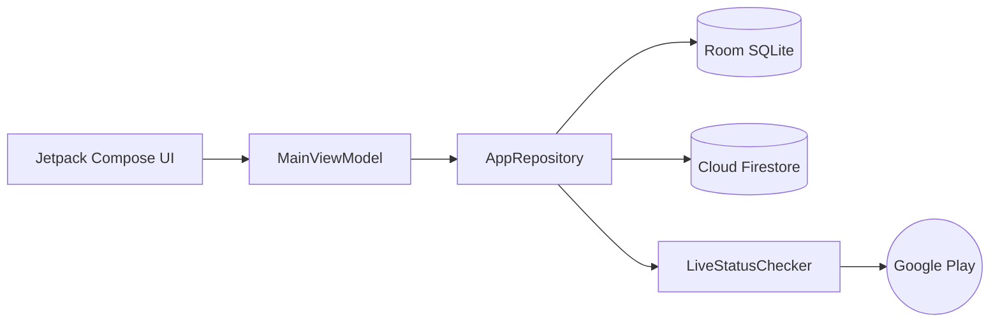

<div align="center">

# 📱 AppTrack

**Production-grade Android client portal for real-time Google Play Store availability tracking, live status monitoring, and cloud-synchronized catalog management.**

[](https://developer.android.com)
[](https://kotlinlang.org)
[](https://developer.android.com/jetpack/compose)
[](https://firebase.google.com)
[](https://developer.android.com/topic/architecture)

</div>

---

## ⚡ Highlights

- **Auto-Audit on Open**: Scans Google Play Store endpoints concurrently across all projects at launch.
- **Granular Badge Updates**: Status mutations save directly to SQLite Room; badges update in-place without list rebuilds or scroll jumps.
- **Segmented Tabs**: Independent views and counters for **Apps** and **Games**.
- **Cloud Sync + Offline First**: Server-first Cloud Firestore fetch with instant offline Room caching.
- **Direct Store Launcher**: One-tap intent to view live apps directly on Google Play Store.

---

## 🏷️ Status Badges

| Badge | State | Description |
| :--- | :---: | :--- |
|  | `LIVE` | App is publicly indexed and available on Google Play. |
|  | `NOT_FOUND` | Store returned 404 or "Item not found" (unreleased / delisted). |
|  | `UNABLE_TO_CHECK` | Network timeout, DNS failure, or connection error. |
|  | `PENDING` | Initial state awaiting verification. |
|  | *Transient* | Active background coroutine scanning the store. |

---

## 🏗️ Architecture



- **UI**: Jetpack Compose + Material 3 with reactive `StateFlow`.
- **Data**: Single Source of Truth via Room SQLite database.
- **Sync**: Server-first Firestore query scoped to `currentUserEmail`.
- **Verifier**: Parallel OkHttp3 scanner with mobile Android User-Agent.

---

## 🗄️ Firestore Schema

### `apps` Collection
| Field | Type | Description |
| :--- | :--- | :--- |
| `title` | `string` | App display name |
| `packageName` | `string` | Unique package ID (`com.example.app`) |
| `category` | `string` | `"APP"` or `"GAME"` |
| `userEmail` | `string` | Client owner email for access control |
| `status` | `string` | `"LIVE"`, `"NOT_FOUND"`, `"PENDING"`, `"UNABLE_TO_CHECK"` |
| `iconUrl` | `string` *(optional)* | Custom icon URL (falls back to theme glyph) |
| `liveStoreUrl` | `string` *(optional)* | Direct Play Store link |
| `lastCheckedTimestamp` | `number` | Unix timestamp of last verification |

### `users` Collection
`email` (`string`), `name` (`string`), `role` (`string`).

---

## 🚀 Quick Start

### 1. Prerequisites
- Android Studio Ladybug (2024.2.1+) & JDK 17+
- Add `google-services.json` to `app/`

### 2. Build Commands
```bash
# Debug APK
./gradlew assembleDebug

# Release APK
./gradlew assembleRelease
```

---

## 🌿 Git Workflow

- **`develop`**: Active integration branch for all features and fixes.
- **`main`**: Production releases. Pushing to `main` triggers automated CI/CD signed APK builds.

---

<div align="center">

Made with ❤️ using **Jetpack Compose** & **Kotlin**

</div>